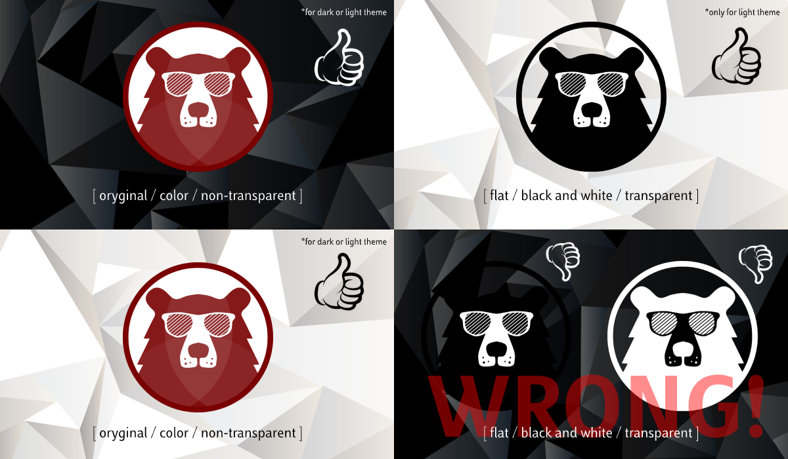

<p align="center"></p>

# BEAR Coin Brand Identity
Logo icons, logotypes, images and other related content associated with [BEAR Coin](https://bearcoin.net/).

## Logo, icons and logotypes
Logo, icons and logotypes can be found in [logo](logo/)
<p align="center"></p>

## Favicon and App Icons
Favicon and App Icons can be found in [ico](ico/)

[Favicon](ico/favicon.ico) is small 16x16 icon file that are displayed next to the URL of site in a browser's address bar. Additionally often displayed next to the name of site in a user's list of open tabs and bookmark listings. App Icons are the images you press on your smartphone to launch an application.

In case web/app development usage, please include the following code in the head of your HTML document:
```
<link rel="apple-touch-icon" sizes="57x57" href="/apple-icon-57x57.png">
<link rel="apple-touch-icon" sizes="60x60" href="/apple-icon-60x60.png">
<link rel="apple-touch-icon" sizes="72x72" href="/apple-icon-72x72.png">
<link rel="apple-touch-icon" sizes="76x76" href="/apple-icon-76x76.png">
<link rel="apple-touch-icon" sizes="114x114" href="/apple-icon-114x114.png">
<link rel="apple-touch-icon" sizes="120x120" href="/apple-icon-120x120.png">
<link rel="apple-touch-icon" sizes="144x144" href="/apple-icon-144x144.png">
<link rel="apple-touch-icon" sizes="152x152" href="/apple-icon-152x152.png">
<link rel="apple-touch-icon" sizes="180x180" href="/apple-icon-180x180.png">
<link rel="icon" type="image/png" sizes="192x192"  href="/android-icon-192x192.png">
<link rel="icon" type="image/png" sizes="32x32" href="/favicon-32x32.png">
<link rel="icon" type="image/png" sizes="96x96" href="/favicon-96x96.png">
<link rel="icon" type="image/png" sizes="16x16" href="/favicon-16x16.png">
<link rel='shortcut icon' type='image/x-icon' href='/favicon.ico' />
<link rel="manifest" href="/manifest.json">
<meta name="msapplication-TileColor" content="#ffffff">
<meta name="msapplication-TileImage" content="/ms-icon-144x144.png">
<meta name="theme-color" content="#ffffff">
```

## Security
If you discover a security vulnerability or any other issue within this package, please send an e-mail to contact@bearcoin.net

## Credits
This project exists thanks to all the people who [contribute](../../contributors).

## License
[MIT](LICENSE) © [BEAR Coin](https://bearcoin.net/)
